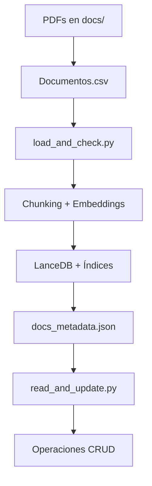

# Vector Database Management System
Sistema de gestión de base de datos vectorial con operaciones CRUD completas para documentos PDF. Implementa RAG (Retrieval-Augmented Generation) usando LanceDB, embeddings Nomic y Ollama con Llama 3.2.


## Características Principales

- **Base Vectorial LanceDB**: Almacenamiento eficiente con índices IVF_PQ y HNSW
- **Embeddings Locales**: Nomic embeddings (768 dimensiones) vía Ollama
- **Procesamiento PDF**: Extracción de texto con Docling y chunking inteligente
- **CRUD Completo**: Crear, leer, actualizar y eliminar documentos
- **Interfaz Terminal**: Menús interactivos para gestión de documentos
- **Tests Automatizados**: Suite completa con PyTest
- **Metadatos JSON**: Correspondencia y orden de documentos

## Stack Técnico

- **Base Vectorial**: LanceDB
- **Embeddings**: Nomic (nomic-embed-text-v2)
- **Modelo LLM**: Llama 3.2 vía Ollama
- **Procesamiento**: Docling, Polars
- **Testing**: PyTest
- **Framework**: Agno AI

## 📁 Estructura del Proyecto

```
ai-agent/
├── docs/                           # Documentos PDF para procesamiento
├── docs_test/                      # PDFs para testing
├── load_and_check.py              # Creación y validación de base vectorial
├── read_and_update.py             # Operaciones CRUD sobre la base
├── test_load_and_check.py         # Tests de carga y consistencia
├── test_read_and_update.py        # Tests de operaciones CRUD
├── Documentos.csv                 # Metadatos de documentos
├── docs_metadata.json             # Correspondencia y orden
└── requirements.txt               # Dependencias del proyecto
```

## 🚀 Instalación y Configuración

### 1. Clonar el repositorio
```bash
git clone <repository-url>
cd ai-agent
```

### 2. Crear entorno virtual
```bash
python -m venv my-rag
source my-rag/bin/activate  # En Linux/Mac
# my-rag\Scripts\activate   # En Windows
```

### 3. Instalar dependencias
```bash
pip install -r requirements.txt
```

### 4. Configurar Ollama
```bash
# Instalar Ollama (https://ollama.ai/)
ollama pull llama3.2
ollama pull nomic-embed-text-v2
```

### 5. Preparar documentos
- Colocar archivos PDF en la carpeta `docs/`
- Asegurar que estén listados en `Documentos.csv` con formato:
  ```csv
  ID;Título;Fuente;Nombre_archivo
  1;Título del documento;https://fuente.com;documento.pdf
  ```

## 📖 Guía de Uso

### Script Principal: Creación de Base Vectorial

#### `load_and_check.py`
Crea la base de datos vectorial inicial procesando documentos PDF.

```bash
# Activar entorno virtual
source my-rag/bin/activate

# Ejecutar script principal
python load_and_check.py
```

**Funcionalidades:**
- ✅ Lista documentos disponibles (coincidencia carpeta + CSV)
- ✅ Permite selección manual o automática (`.` para todos)
- ✅ Procesa PDFs con chunking inteligente (max 512 palabras)
- ✅ Genera embeddings con nomic-embed-text-v2
- ✅ Crea índices optimizados (HNSW para <1K, IVF_PQ para >1K vectores)
- ✅ Guarda metadatos JSON para correspondencia
- ✅ Incluye consulta interactiva final

### Script CRUD: Gestión de Documentos

#### `read_and_update.py`
Interfaz completa para operaciones CRUD sobre la base vectorial.

```bash
# Activar entorno virtual
source my-rag/bin/activate

# Ejecutar interfaz CRUD
python read_and_update.py
```

**Funcionalidades:**

🔍 **Validación Automática:**
- Detecta si existe base de datos vectorial
- Ofrece crear base nueva si no existe
- Maneja estados: vacía, sin tabla, o completa

📊 **Información al Inicio:**
- Estadísticas generales de la base
- Listado de documentos vectorizados
- Distribución por documento

🛠️ **Operaciones CRUD:**
1. **READ**: Leer detalles completos de documento
2. **CREATE**: Agregar nuevos documentos desde CSV
3. **UPDATE**: Actualizar metadatos (título, fuente)
4. **DELETE**: Eliminar documento de la base vectorial

⚙️ **Características Avanzadas:**
- Reindexación opcional tras CREATE/DELETE
- Validación de entrada robusta
- Manejo de errores comprehensivo
- Limpieza automática de archivos temporales

### Menú Principal
```
╔══════════════════════════════════════════════════════════╗
║               GESTIÓN BASE VECTORIAL                     ║
╚══════════════════════════════════════════════════════════╝

OPERACIONES CRUD:
  1. Leer detalles de documento (READ)
  2. Agregar nuevo documento (CREATE)
  3. Actualizar metadatos (UPDATE)
  4. Eliminar documento (DELETE)
  0. Salir
```

## 🧪 Testing

### Tests de Carga y Consistencia

#### `test_load_and_check.py`
Verifica que la carga de documentos mantenga consistencia de palabras.

```bash
# Ejecutar todos los tests de carga
python -m pytest test_load_and_check.py -v

# Tests específicos
python -m pytest test_load_and_check.py::test_word_count_consistency_1_document -v
python -m pytest test_load_and_check.py::test_word_count_consistency_2_documents -v
python -m pytest test_load_and_check.py::test_word_count_consistency_3_documents -v
```

**Verificaciones:**
- ✅ Consistencia de conteo pre/post LanceDB
- ✅ Integridad de chunking y concatenación
- ✅ Preservación de orden de procesamiento
- ✅ Generación correcta de metadatos JSON

### Tests CRUD Completos

#### `test_read_and_update.py`
Suite completa para verificar operaciones CRUD al 100%.

```bash
# Ejecutar tests CRUD completos
python -m pytest test_read_and_update.py -v

# Test específico de operaciones CRUD
python -m pytest test_read_and_update.py::test_crud_operations_complete -v

# Test de validación de estados de BD
python -m pytest test_read_and_update.py::test_database_validation_states -v
```

**Cobertura de Testing:**
- ✅ **READ**: 100% documentos consultables
- ✅ **UPDATE**: 100% metadatos actualizables
- ✅ **DELETE**: 100% documentos eliminables
- ✅ **Validación**: Estados de BD (empty, no_table, exists)
- ✅ **Persistencia**: Cambios guardados correctamente

### Resultados de Testing
Los tests generan archivos detallados de resultados:
```
test_results_1_documento.txt     # Resultado test 1 documento
test_results_2_documentos.txt    # Resultado test 2 documentos  
test_results_3_documentos.txt    # Resultado test 3 documentos
test_crud_results_complete.txt   # Resultado tests CRUD completos
```

## 📊 Arquitectura del Sistema

### Flujo de Procesamiento


### Componentes Clave
- **Chunking**: Párrafos inteligentes con límite de 512 palabras
- **Embeddings**: Nomic 768D para búsqueda semántica
- **Índices**: HNSW (datasets pequeños) + IVF_PQ (datasets grandes)
- **Metadatos**: JSON con correspondencia y orden de procesamiento
- **Testing**: PyTest con cobertura 100% CRUD

## 🔧 Configuración Avanzada

### Variables de Configuración
```python
LANCEDB_PATH = "tmp/lancedb"          # Ruta base vectorial
TABLE_NAME = "docs_qa"               # Nombre tabla principal
EMBEDDING_DIM = 768                  # Dimensiones embedding
MAX_WORDS = 512                      # Palabras máximas por chunk
METADATA_FILE = "docs_metadata.json" # Archivo correspondencia
```

### Optimización de Índices
- **< 1,000 vectores**: HNSW (m=32, ef_construction=100)
- **1K - 5K vectores**: IVF_PQ (√N particiones)  
- **> 5K vectores**: IVF_PQ (6K vectores/partición)

## 🐛 Solución de Problemas

### Errores Comunes

**Error: "No hay archivos PDF que coincidan"**
```bash
# Verificar que PDFs estén en docs/ Y en Documentos.csv
ls docs/
head Documentos.csv
```

**Error: "Base de datos vectorial no encontrada"**
```bash
# Crear base primero con load_and_check.py
python load_and_check.py
```

**Error: Ollama no disponible**
```bash
# Verificar modelos instalados
ollama list
ollama pull llama3.2
ollama pull nomic-embed-text-v2
```

## 📈 Rendimiento

### Benchmarks Típicos
- **Procesamiento**: ~30-50 chunks/segundo
- **Índices**: HNSW (rápido), IVF_PQ (memoria eficiente)
- **Consultas**: <100ms para bases <10K vectores
- **Testing**: Suite completa ~70 segundos

### Escalabilidad
- **Documentos**: Sin límite teórico
- **Memoria**: ~1MB por 1K vectores (768D)
- **Disco**: Índices comprimen 4-8x vs vectores raw

## 🤝 Contribución

1. Fork el proyecto
2. Crear branch para feature (`git checkout -b feature/AmazingFeature`)
3. Commit cambios (`git commit -m 'Add AmazingFeature'`)
4. Push branch (`git push origin feature/AmazingFeature`)
5. Abrir Pull Request

## 📄 Licencia

MIT License - ver archivo LICENSE para detalles.

## 🙏 Reconocimientos

- [Agno AI Framework](https://github.com/agno-ai/agno) - Framework RAG
- [LanceDB](https://lancedb.com/) - Base de datos vectorial
- [Ollama](https://ollama.ai/) - Modelos locales
- [Docling](https://github.com/DS4SD/docling) - Procesamiento PDF
